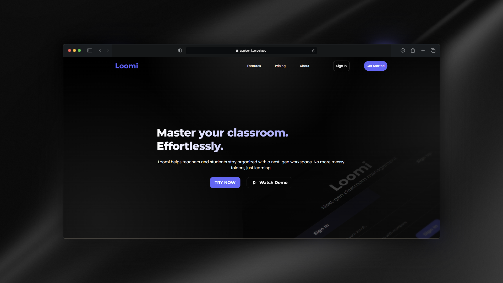

# Loomi | Next-gen Classroom Management


<div align="center">
  
  <br />
  <p align="center">
    <b>A seamless workspace for modern education.</b>
    <br />
    <a href="https://apploomi.vercel.app"><strong>Visit Live Site »</strong></a>
  </p>
</div>

---

### 🚀 Overview
**Loomi** is a high-performance Learning Management System (LMS) designed to eliminate the friction between teaching and learning. Unlike traditional tools, Loomi focuses on a **unified workflow**, providing a "Single Source of Truth" for students and teachers through a modern, bento-style interface.

## 🛠️ Roadmap & Status
Loomi is currently in **Active Development**.

### ✨ Key Features
* **Bento Dashboard:** At-a-glance view of next classes, pending tasks, and stats.
* **Smart Auth:** Secure authentication powered by Supabase with custom role-based redirection.
* **Modern UI/UX:** Dark-mode first design with glassmorphism effects and smooth transitions.
* **Role Management:** Tailored experiences for both Teachers and Students.

### 🛠️ Tech Stack
| Tool | Purpose |
| :--- | :--- |
| **Vue.js 3** | Progressive JavaScript Framework (Composition API) |
| **TypeScript** | Type safety and scalable architecture |
| **SupaBase** | Backend-as-a-Service (Auth & PostgreSQL Database) |
| **Vite** | Lightning-fast build tool and dev server |
| **Vue Router** | Single Page Application (SPA) navigation |

---

## 📂 Project Structure
```text
src/
├── assets/         # Styles & Media
├── components/     # Reusable UI Components
├── views/          # Page-level components (Landing, Login, Dashboard)
└── router/         # Navigation logic
````
## ⚙️ Installation & Setup
### 1. Clone the repository

````Bash
git clone [https://github.com/oriioll/loomi.git](https://github.com/oriioll/loomi.git)
cd loomi
````
### 2. Install dependencies

````Bash
npm install
````

### 3. Environment Variables Create a .env file in the root directory and add your Supabase credentials:

````
VITE_SUPABASE_URL=your_url
VITE_SUPABASE_ANON_KEY=your_key
````
### 4. Run Development Server

````Bash
npm run dev
````

---
## 📦 Production
To build the project for production:

````Bash
npm run build
````
## 📄 License
This project is licensed under the MIT License.

<div align="center"> Made by Oriol Plazas </div>